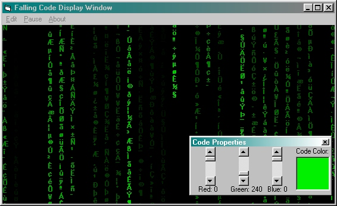



## Falling Code \- A Matrix Code Variant

### Description

This is yet another piece of code that mimics the "falling code" used in The Matrix. Unlike other versions of this code, mine uses pictureboxes to scroll the falling text, thus making it a little bit faster and smoother in the falling. The text falls at different speeds varying from very slow to very fast, and gives it an even more realistic effect in doing so. Also, as if that wasn't enough, you are able to edit the color of the falling text both while the program is running, a feature i have yet to see in other similar code.
 
### More Info
 

             |
---                |---
**Submitted On**   |2001-04-01 12:03:20
**By**             |[Michael Dzicek](https://github.com/Planet-Source-Code/PSCIndex/blob/master/ByAuthor/michael-dzicek.md)
**Level**          |Intermediate
**User Rating**    |4.7 (28 globes from 6 users)
**Compatibility**  |VB 4\.0 \(32\-bit\), VB 5\.0, VB 6\.0
**Category**       |[Graphics](https://github.com/Planet-Source-Code/PSCIndex/blob/master/ByCategory/graphics__1-46.md)
**World**          |[Visual Basic](https://github.com/Planet-Source-Code/PSCIndex/blob/master/ByWorld/visual-basic.md)
**Archive File**   |[Falling Co17782412001\.zip](https://github.com/Planet-Source-Code/michael-dzicek-falling-code-a-matrix-code-variant__1-22028/archive/master.zip)

